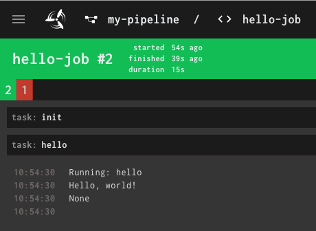

# DSL

## Pipelines
To create a pipeline, use a python `with` block:

```python
with Pipeline("my-pipeline") as pipeline:
    ...
```

## Jobs and Tasks
A Job is specified as another `with` block inside the pipeline's `with` block:

```python
with Pipeline("my-pipeline") as pipeline:
    with pipeline.job("hello-job") as job:

        @job.task()
        def hello():
            print("Hello, world!")
```

This creates a new pipeline called `my-pipeline` with a single job `hello-job`. This job has only one task: `hello`. When the task is executed, the according function is called. In this case, "Hello, world!" is printed and shows up in concourse logs:



In the `pipeline.job(..)` call all parameters from [concourse's job documentation](https://concourse-ci.org/jobs.html) can be specified via named arguments. (Except `plan`: It is automatically generated from the specified tasks.)

The tasks can also contain named arguments (in the annotation). All parameters from [concourse's task documentation](https://concourse-ci.org/tasks.html) can be specified.

```python
with pipeline.job("hello-job", timeout="5m") as job:

    @job.task(timeout="90s")
    def hello():
        print("Hello, world!")
```

### Secrets
Tasks can receive secrets as input parameters:

```python
@job.task(secrets={ "my_secret_arg": "MY_SECRET_IN_SECRET_STORE" })
def hello(my_secret_arg):
    print(f"Secret is {my_secret_arg}") 
```

The secret with the specified name (in this case `MY_SECRET_IN_SECRET_STORE`) will be available as an environement variable with the same name and will be passed to the function as the parameter with the specified name (in this case `my_secret_arg`). 

## Resources
To specify resources used in a pipeline, you'll have to specify them in the according pipeline's block:

```python
with Pipeline("c21s") as pipeline:
    pipeline.resource("kubernetes", GitRepo("https://github.com/kubernetes/kubernetes"))
```

To use these resources in a job, reference them in the job's block:

```python
with pipeline.job("hello-job") as job:
    kubernetes = job.get("kuberetes")

    @job.task()
    def hello():
        print(f"Kubernetes is on version {kubernetes.ref()}")
```


Resources can also exectue `put` tasks:
```python
with pipeline.job("bump-cf4k8s-templates", serial=True) as job:
    job.get("my-repo")

    @job.task(outputs=["publish"], timeout="45m")
    def do_sth_with_repo(**kwargs):
        # Copy my-repo to publish/my-repo
        # Work on publish/my-repo
    
    job.put("my-repo", params={"repository": "publish/my-repo", "rebase": True})
```

The exact params depend on the resource used. For a list of resources available in pypeline, see [resources](./resources.md).

### Passed
Pypeline will automatically add all prior jobs, using the same resource (`get` or `put`), to the `passed` argument of `get`-steps. If this is not intended, the passed argument has to be specified explicitly (e.g. `job.get("my-repo", passed=[])`).
