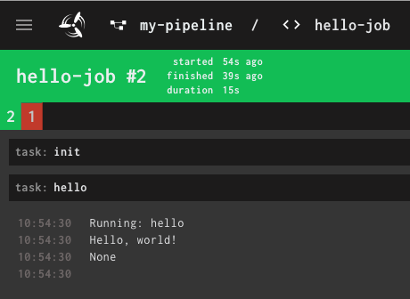
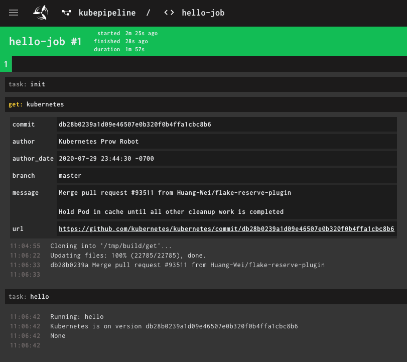

# Users Guide

## Pipelines
To create a pipeline, use a python `with` block:

```python
with Pipeline("my-pipeline") as pipeline:
    ...
```

## Jobs and Tasks
A Job is specified as another `with` block inside the pipeline's `with` block:

```python
with Pipeline("my-pipeline") as pipeline:
    with pipeline.job("hello-job") as job:

        @job.task()
        def hello():
            print("Hello, world!")
```

This creates a new pipeline called `my-pipeline` with a single job `hello-job`. This job has only one task: `hello`. When the task is executed, the according function is called. In this case, "Hello, world!" is printed and shows up in concourse logs:



In the `pipeline.job(..)` call all parameters from [concourse's job documentation](https://concourse-ci.org/jobs.html) can be specified via named arguments. (Except `plan`: It is automatically generated from the specified tasks.)

The tasks can also contain named arguments (in the annotation). All parameters from [concourse's task documentation](https://concourse-ci.org/tasks.html) can be specified.

```python
with pipeline.job("hello-job", timeout="5m") as job:

    @job.task(timeout="90s")
    def hello():
        print("Hello, world!")
```

### Secrets

You can use values provided by the concourse secret manager as input variable to you task function:

```python
@job.task(secrets={ "my_secret_arg": "MY_SECRET_IN_SECRET_STORE" })
def hello(my_secret_arg):
    print(f"Secret is {my_secret_arg}") 
```

The secret with the specified name (in this case `MY_SECRET_IN_SECRET_STORE`) will be available as an environment variable with the same name and will be passed to the function as the parameter with the specified name (in this case `my_secret_arg`). 

In a local environment the secret values are taken from environment variables.


## Resources
To specify resources used in a pipeline, you'll have to specify them in the according pipeline's block. A complete working example can be found [here](../examples/resources.py)

```python
with Pipeline("kubernetes") as pipeline:
    pipeline.resource("kubernetes", GitRepo("https://github.com/kubernetes/kubernetes"))
```

### Use a resource within a task

To get access to a repository, you need to do the following
* declare the repository as pipeline resource
* use `resource = job.get` to clone it into you workspace
* use `resource.path` to get the location of the repository inside you workspace


```python
with pipeline.job("kube-job") as job:
    kubernetes = job.get("kubernetes")

    @job.task()
    def kube_task():
        print(f"Kubernetes workspace path {kubernetes.path}")
        print(f"Kubernetes is on version {kubernetes.ref()}")
```



### Outputs

You can use output folders for your tasks. Therefore, you can use the `outputs` parameter passed to the `task` decoration. For each declared output, a parameter is passed to your task function. You should use this parameter get the location of the output folder.

In a local environment, this folder will be located in `/tmp/outputs/<job>/<output>`. If running inside concourse, this path will be located inside your workspace.

```
@job.task(outputs=["out"])
def tag(out):
    with open(os.path.join(out,"tag"), "w") as file:
      file.write("stable-" + datetime.now().isoformat('T'))
```

### Put a resource

Resources can also execute `put` tasks:
```python
with pipeline.job("bump-cf4k8s-templates", serial=True) as job:
    job.get("my-repo")

    @job.task(outputs=["publish"], timeout="45m")
    def do_sth_with_repo(**kwargs):
        # Copy my-repo to publish/my-repo
        # Work on publish/my-repo
    
    job.put("my-repo", params={"repository": "publish/my-repo", "rebase": True})
```

The exact params depend on the resource used. For a list of resources available in pypeline, see [the reference guide](./reference.md#resources).

### Passed attribute on get steps

Pypeline will automatically adds all prior jobs, using the same resource (`get` or `put`), to the `passed` argument of `get`-steps. If this is not intended, the passed argument has to be specified explicitly (e.g. `job.get("my-repo", passed=[])`).


## Local execution

It's possible to execute each task locally

```
python <pipeline> --job <job> --task <task>
```

In this case 
* all repositories are expected to be located in `$HOME/workspace/<resourcename>`
* all secrets are set as environment variable
* no get actions on resources are executed
* no put actions on resources are executed


### Reusing code

#### Using libraries

You can use `pipeline.path_append(dir)` to package a library within your pipeline. This command 
* includes all `*.py` files from the specified directory to the pipeline
* sets the system path `sys.path.append(dir)` in a way that this path will be searched automatically.

#### Loading code from repositories

You can also put the code into a separate repository and load this code at runtime using `sys.path.append(dir)`

```python
with pipeline.job("mylib-job") as job:
    mylib = job.get("mylib")

    @job.task()
    def mylib_task():
        sys.path.append(mylib.path)
        ...
```


#### Using ci-cd image

You can also package the code you would like to reuse into you cicd-image (e.g. using pip). You can specify the cicd-image which should be used for each pipeline, job or task.


## Calling other tasks

This feature is currently not available