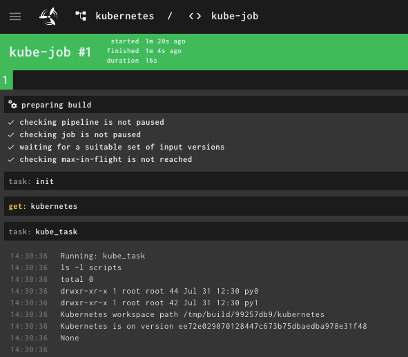

# Users Guide

## Pipelines
To create a pipeline, use a python `with` block:

```python
with Pipeline("my-pipeline") as pipeline:
    ...
```

## Jobs and Tasks
A Job is specified as another `with` block inside the pipeline's `with` block:

```python
with Pipeline("my-pipeline") as pipeline:
    with pipeline.job("hello-job") as job:

        @job.task()
        def hello():
            print("Hello, world!")
```

This creates a new pipeline called `my-pipeline` with a single job `hello-job`. This job has only one task: `hello`. When the task is executed, the according function is called. In this case, "Hello, world!" is printed and shows up in concourse logs:


In the `pipeline.job(..)` call all parameters from [concourse's job documentation](https://concourse-ci.org/jobs.html) can be specified via named arguments. (Except `plan`: It is automatically generated from the specified tasks.)

The tasks can also contain named arguments (in the annotation). All parameters from [concourse's task documentation](https://concourse-ci.org/tasks.html) can be specified.

```python
with pipeline.job("hello-job", timeout="5m") as job:

    @job.task(timeout="90s")
    def hello():
        print("Hello, world!")
```

### Secrets

You can use values provided by the concourse secret manager as input variable to you task function:

```python
@job.task(secrets={ "my_secret_arg": "MY_SECRET_IN_SECRET_STORE" })
def hello(my_secret_arg):
    print(f"Secret is {my_secret_arg}")
```

The secret with the specified name (in this case `MY_SECRET_IN_SECRET_STORE`) will be available as an environment variable with the same name and will be passed to the function as the parameter with the specified name (in this case `my_secret_arg`).

In a local environment the secret values are taken from environment variables or read from the secret-manager (see command line arguments).


## Resources
To specify resources used in a pipeline, you'll have to specify them in the according pipeline's block. A complete working example can be found [here](../examples/resource.py).

```python
with Pipeline("kubernetes") as pipeline:
    pipeline.resource("kubernetes", GitRepo("https://github.com/kubernetes/kubernetes"))
```

### Use a resource within a task

To get access to a repository, you need to do the following

* declare the repository as pipeline resource
* use `resource = job.get` to clone it into you workspace
* use `resource.path` to get the location of the repository inside your workspace


```python
with pipeline.job("kube-job") as job:
    kubernetes = job.get("kubernetes")

    @job.task()
    def kube_task():
        print(f"Kubernetes workspace path {kubernetes.path}")
        print(f"Kubernetes is on version {kubernetes.ref()}")
```



### Outputs

You can use output folders for your tasks. Therefore, you can use the `outputs` parameter passed to the `task` decoration. For each declared output, a parameter is passed to your task function. You should use this parameter get the location of the output folder.

In a local environment, this folder will be located in `/tmp/outputs/<job>/<output>`. If running inside concourse, this path will be located inside your workspace.

```python
@job.task(outputs=["out"])
def tag(out):
    with open(os.path.join(out,"tag"), "w") as file:
      file.write("stable-" + datetime.now().isoformat('T'))
```

### Put a resource

Resources can also execute `put` tasks:
```python
with pipeline.job("bump-cf4k8s-templates", serial=True) as job:
    source = job.get("my-repo")

    @job.task(outputs=["publish"], timeout="45m")
    def do_sth_with_repo(publish):
        shutil.copytree(source.path,publish)

    job.put("my-repo", params={"repository": "publish/my-repo", "rebase": True})
```

The exact params depend on the resource used. For a list of resources available in the pipeline-dsl for Concourse, see [the reference guide](./reference.md#resources).

### Passed attribute on get steps

The pipeline-dsl for Concourse will automatically add all prior jobs, using the same resource (`get` or `put`), to the `passed` argument of `get`-steps. If this is not intended, the passed argument has to be specified explicitly (e.g. `job.get("my-repo", passed=[])`).


### Using shell scripts

It's possible to package shell scripts within the pipeline to speed up turnaround times (no commits required). Therefore, you can specify a parameter `script_dirs` when constructing a `Pipeline`. This parameter is a dictionary, which hold a key and a relative path (from the python script which describes the pipeline) to a directory. This directory is packaged automatically and can be accessed using `Pipeline.script_dir(key)`.

```python
with Pipeline("test",script_dirs={"myscripts":"../bin"}) as pipeline:
    with pipeline.job("job") as job:
        @job.task()
        def task():
            script_dir = pipeline.script_dir("myscripts")
            shell([os.path.join(script_dir),"task.sh"])
```

When running locally, `Pipeline.script_dir(key)` returns the local path to your scripts.


## Groups

The pipeline-dsl for Concourse supports defining groups for your jobs. Citing from [the concourse documentation](https://concourse-ci.org/pipelines.html#schema.pipeline.groups):

> Groups have no functional effect on your pipeline. They are purely for making it easier to grok large pipelines in the web UI.
>
> Note: once you have added groups to your pipeline, all jobs must be in a group.

```python
with Pipeline("test") as pipeline:
    with pipeline.job("job1", groups=["my-group"]) as job:
        @job.task()
        def task1():
            pass

    with pipeline.job("job2", groups=["my-other-group"]) as job:
        @job.task()
        def task2():
            pass
```


## Local execution

It's possible to execute each task locally

```
python3 <pipeline> --job <job> --task <task>
```

In this case

* all repositories are expected to be located in `$HOME/workspace/<basename of github repo>`
* all secrets are either set as environment variable or the flag `--secret-manager vault` is passed as argument. In the second case you need to run `vault login` before starting the task locally.
* no get actions on resources are executed
* no put actions on resources are executed


## Reusing code

### Using libraries

You can use `pipeline.path_append(dir)` to package a library within your pipeline. This command

* includes all `*.py` files from the specified directory to the pipeline
* sets the system path `sys.path.append(dir)` in a way that this path will be searched automatically.

```python
with pipeline.job("mylib-job") as job:
  pipeline.path_append("/usr/local/lib/kubernetes")

  from kubernetes import client, config
  @job.task()
  def task():
    v1 = client.CoreV1Api()
    print("Listing pods with their IPs:")
    ret = v1.list_pod_for_all_namespaces(watch=False)
```

### Loading code from repositories

You can also put the code into a separate repository and load this code at runtime using `sys.path.append(dir)`

```python
with pipeline.job("mylib-job") as job:
    mylib = job.get("mylib")

    @job.task()
    def mylib_task():
        sys.path.append(mylib.path)
        ...
```


### Using ci-cd image

You can also package the code you would like to reuse into you cicd-image (e.g. using pip). You can specify the cicd-image which should be used for each pipeline, job or task.


## Command line arguments

| Argument         | Description                               |
|------------------|-------------------------------------------|
| -h, --help       | show this help message and exit           |
| --job JOB        | name of the job to run                    |
| --task TASK      | name of the task to run                   |
| --target TARGET  | upload concourse yaml to the given target |
| --concourse      | set concourse context to true             |
| --secret-manager | {env,vault}  set secret manager           |
| --dump           | dump concourse yaml                       |

## Calling other tasks

This feature is currently not available.
